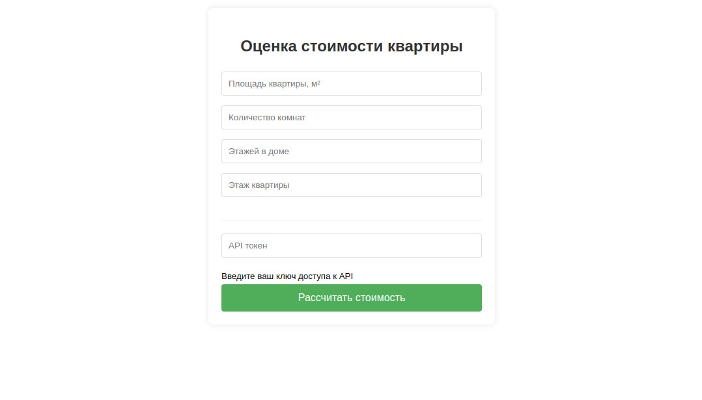

## Housing Price Prediction Model

### Описание проекта
Проект направлен на создание модели машинного обучения для прогнозирования цен на жилье. Модель использует различные характеристики объектов недвижимости для предсказания их рыночной стоимости.

### Структура проекта
```
housing_price_prediction/
├── data/
│   ├── raw/                    # Исходные данные
├── models/                     # Обученные модели
├── notebooks/                  # Jupyter notebooks
├── service/                    # Сервис предсказания цены на недвижимость
│   ├── templates/              # Шаблоны для веб-приложения
│   ├── app.py                  # Flask приложение
├── src/                        # Исходный код
├── requirements.txt            # Требования к зависимостям
└── README.md
```

### Архитектура сервиса ПА


### Данные
Используемые данные для обучения модели включают в себя следующие признаки:
* Площадь жилья (total_meters)
* Количество комнат (rooms_count)
* Количество этажей (floors_count)
* Номер этажа (floor)


В выборке 1, 2, 3 комнатные квартиры и студии


### Как запустить
1. Клонируйте репозиторий:
```
git clone https://github.com/MaksKhramtsov/pabd_25
```

2. Создайте venv и установите зависимости:
```
python -m venv venv
venv/Scripts/activate # Для Windows
source venv/bin/activate # Для Mac OS
pip install -r requirements.txt
```

3. Запустите цикл сбора данных и обучения:
```
dvc repro
```
4. Запустите flusk приложение:
```
cd service; python app.py
```

### Модели машинного обучения
- XGBoost - экстремальный градиентный бустинг 


### Метрики оценки
- Mean Absolute Error (MAE)
- Mean Squared Error (MSE)
- Root Mean Squared Error (RMSE)
- R² Score

### Результаты
После обучения модели достигаются следующие результаты:

- MSE: ~ 46902036922368.0
- MAE: ~ 5983722.5
- RMSE: ~ 6848506.1818157109
- R² Score: ~ 0.509341

### Как использовать модель
1. Загрузите данные в формате CSV
2. Обработайте данные с помощью предобработчиков. В данных должно остаться 4 признака:
* total_meters
* rooms_count
* floors_count
* floor
3. Загрузите обученную модель из файла ".pkl"
```
with open(model_path, 'rb') as file:
    model = pickle.load(file)
```
4. Сделайте предсказания
```
prediction = int(model.predict(input_df).round(0))
```

### Использование сервиса предиктивной аналитики в dev mode
1. Запустите сервис
```
cd service; python app.py
```
2. Веб приложение доступно по ссылке http://127.0.0.1:5000 
3. API endpoint доступен  по ссылке http://127.0.0.1:5000/api/numbers

### Интерфейс сервиса


### Автор
Максим Храмцов


### Контакты
* Email: maks_future@mail.ru